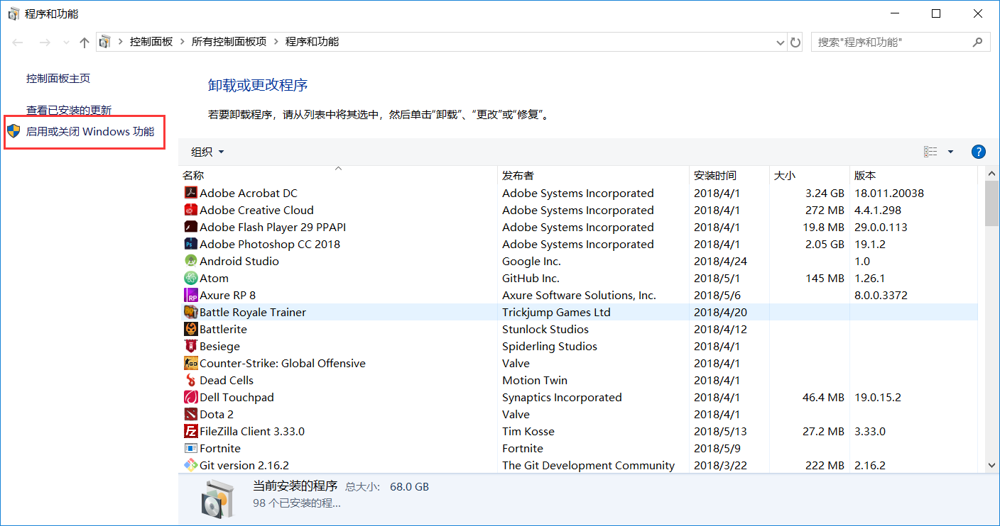
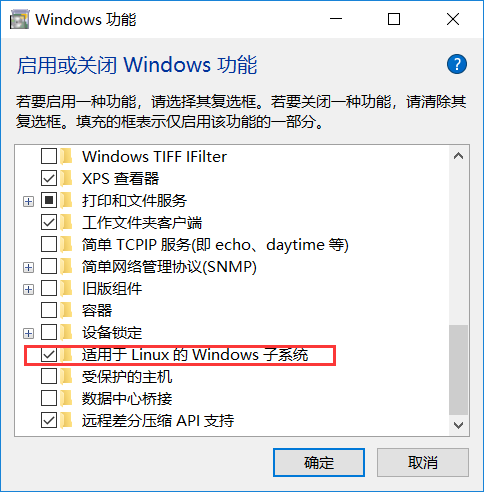
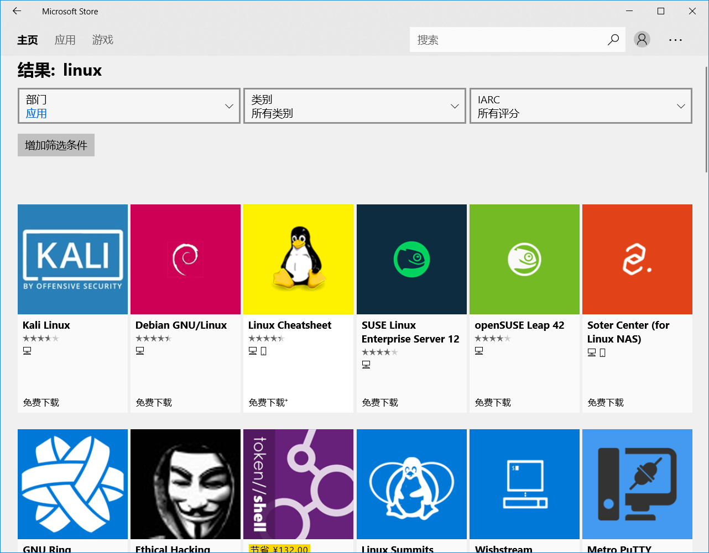
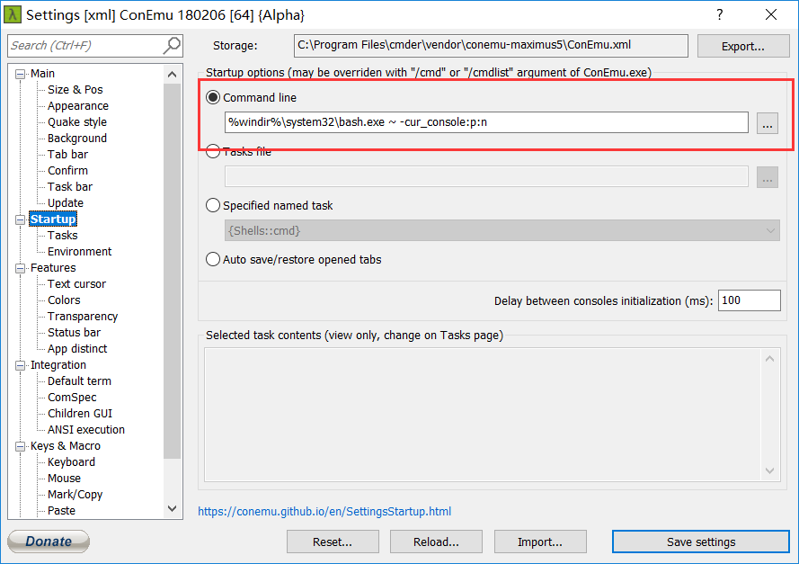
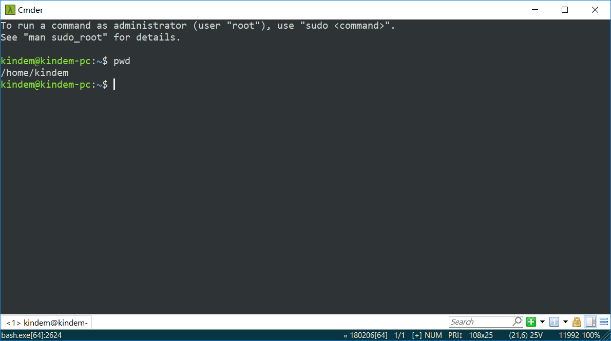

> 发布自[Kindem的博客](http://www.kindemh.cn/)，欢迎大家转载，但是要注意注明出处

# 什么是Bash On Windows
Bash On Windows是微软的“Microsoft Love Linux”计划中重要的一环，目的是能让Windows用户能在系统中运行Linux子系统，也就是说你可以直接在Windows中获得原生Linux Bash级别的体验。

# 安装
首先你要确保你的Windows已经升级到创意者更新版本(1709)，因为只有创意者更新版本以后的Windows，Bash On Windows才真正发行，之前的都是测试版本。

首先，你需要进入控制面板的程序与功能界面，点击启动或关闭Windows功能：


然后，把适用于Windows的Linux子系统这一项勾上，并且点击确定


接着，你就可以直接在商店下载你需要的Linux系统了，打开Windows Store，搜索Linux，可以看到很多Linux子系统：


你可以任选一下载，我选的是Ubuntu 18.04，下载完成之后，你可以在Windows任务栏上面的搜索栏直接搜索Ubuntu(我是Ubuntu，如果你下了其他的你就搜其他的)，打开会要求你先重启电脑。

重启之，重启完成之后，再次打开子系统，你会发现他在慢慢解压，如果不成功的话，你可以直接在Windows Store中卸载它并且重新安装就行了，Linux子系统在Windows里面，就相当于一个Windows Store应用。

安装完成之后，你就可以像使用普通Bash一样使用之了。

# 优化
当然，子系统是以cmd的形式跑在Windows里面的，这样显然会有很多问题，比如每次你退格所有字符，就会发出一声让人绝望的Windows错误提示音，再者这样的Linux Bash也不好看。

这里推荐使用cmder优化之，cmder是一个优化版的Windows cmd，但是他可以设置启动命令，我们使用这条启动命令，可以让cmd自动启动Bash，这样就可以让cmder直接运行Bash。

cmder的字体和各种配置是可以设置的，所以，这样用子系统就很舒服！

cmder的官网在这：
[Cmder | Console Emulator](http://cmder.net/)

你可以下载Mini版，也可以下载Full版本，都差不多，运行cmder之后点击右下角的汉堡形按钮，可以看到Settings，进去，像下面这样改动：


代码如下：
```
%windir%\system32\bash.exe ~ -cur_console:p:n
```

这样就可以让他启动的时候自动进入Bash，另外字体什么的就不提了，可以在上面设置，配色什么的也是。

最后放一张我的Ubuntu子系统优化结果：

