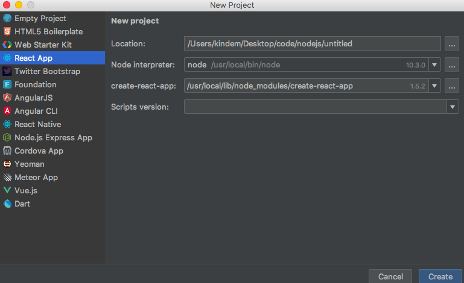

> 发布自[Kindem的博客](http://www.kindemh.cn/)，欢迎大家转载，但是要注意注明出处

# Electron
electron是一个使用HTML、CSS、JavaScript构建跨平台桌面应用的框架。

说白了就是用这个框架，你可以在使用前端技术来开发桌面应用，原理是在本地应用上跑一个抽出来的浏览器，浏览器上放你写的页面。

你可能会问Electron的存在有什么意义，众所周知，前端技术可以让我们轻松写出漂亮易用的界面，如果你尝试过其他的桌面开发技术，想必你也应该知道其他的那些桌面开发工具开发出来的界面有多丑，而Electron轻松地解决了这个问题。而且从另外一个角度来讲，Electron也可以快速地将你的网站打包成一个原生应用发布。总之，前端技术是构建用户界面最好的选择，而Electron则为这一思想在桌面的实现奠定了基础。

# 聊一聊需要用到的前端技术栈
如果你已经对常见的前端技术栈有着一定了解，建议直接跳至下一节，查看electron+react项目的建立方法。

在开始我们的畅聊之前，先要说一说原始的前端技术。众所周知，传统的前端技术都是使用HTML、CSS、JavaScript这御三家来完成开发的，HTML负责页面框架、CSS负责页面样式、JavaScript负责页面动态，这三者各司其职，展现出一个完整美妙的Web世界。

随着前端的发展，这三者开始出现了这样那样的问题，每一项新前端技术的出现，都是前端的一次飞跃。

### Node.js
Node.js的出现，无非是前端发展的一个里程碑，它的出现，将前端推向了一个新的高峰。

> Node.js 是一个基于 Chrome V8 引擎的 JavaScript 运行环境。Node.js 使用了一个事件驱动、非阻塞式 I/O 的模型，使其轻量又高效。 Node.js 的包管理器 npm，是全球最大的开源库生态系统。

看官网的解释你可能还是一脸懵逼，这么说吧，传统的JavaScript只能依赖浏览器而运行，而Node.js则将Chrome的浏览器引擎抽了出来并加以改进，使得JavaScript可以脱离浏览器而运行。

而npm则是Node.js的一个包管理工具，你可以使用npm安装这样那样的JavaScript包，就像python的pip那样简单。

Node.js的出现，使得这样那样的前端开发工具、框架如春笋般涌现，如Grunt、Webpack、React、Vue等等。而且JavaScript能够脱离浏览器而运行，也从某种意义上使JavaScript变成了一个跨平台Native语言。可以说，Node.js，就是如今前端的核心。

### 构建工具
传统的前端JavaScript开发中，会存在一些问题，最大的问题之一，就是项目文件之间的依赖问题，这一问题时常让前端开发者苦恼不已。

随着Node.js的出现，人们对JavaScript的使用方法产生了潜移默化的变化，因为JavaScript已经成为了一门脱离浏览器而存在的Native语言，人们开始将JavaScript像其他语言一样看待。

“编译”，这一概念，也自然地被人们引入了JavaScript的世界，尽管它是一门动态语言。在传统语言中，“编译”这一过程时常是将多个源文件编译并链接成一个可执行文件，“编译”的过程，无非就三个重要点：

* 每一个源文件输出成中间件
* 判断各个中间件之间的相互依赖关系
* 根据依赖关系将中间件打包在一起构成输出

这一思想被运用到JavaScript之后，人们觉得JavaScript也应该有“编译”这一过程，用来做以下事情：

* 将每一个JavaScript文件压缩，删去所有无效字符，输出为中间件
* 判断各个中间件之间的依赖关系
* 根据依赖关系将所有中间件打包成一个输出文件，这个输出文件中具有原来各个JavaScript中的所有功能，但是体积更小，而且依赖关系被严格限制并且无误

这就是构建工具，你可以把他们认为是JavaScript的编译器，用于产生更加适合生产使用的输出文件。

当然这只是构建工具功能的一部分，现在的构建工具往往还具有一些更加高级的功能，比如自动流程等。

现在常见的构建工具有Grunt、Webpack等。

### React
React是一个用于构建用户界面的JavaScript框架，与Vue、Angular这另两大框架相并列。

React的强大之处在于用一种巧妙的思想处理了Web页面中冗余重复代码多的问题。它能将一些可重用的代码封装成一个个组件，在另外使用的时候，只需要使用组件进行实例化即可。这种思想与面向对象的思想非常相像。所以说，从思想和使用上说，React应该是一个非常成熟的框架。

### 前端路由
众所周知，往常Web网站中的路由是交由后端来做的，比如用户访问

```
/match/2
```

这么一个url，本来应该是由后端服务器来接收请求并且做出相应的处理。但是随着Node.js和构建工具的出现，人们开始想，那么多请求都要交由后端来做岂不是很麻烦，而且从某种意义上，Web网站本身就是一个应用，其中的地址变化处理的逻辑应该在应用内部解决，只有涉及到后端需求的，才交由服务器来处理。

所以，前端路由，应运而生。

前端路由的存在意义就在于将路径逻辑交由前端来处理，而不是后端，这样能让后端专注与真正需要后端资源的请求的处理。

前端路由往往与构建工具、前端界面框架相互配合，构建工具负责将所有文件打包，而前端界面框架往往自己带有自己的前端路由框架，最后打包出来的输出文件，一般只有一个inedx.html、一个bunble.js和其他的资源文件。一个index.html，配合bunble.js，就能展现所有页面的内容。

这样既能减少请求量，又符合人们的正常思想，一个网站就是一个应用，像Native那样，应用内部的逻辑由应用自己处理，真正需要后端支援的时候才发送请求到服务器，让服务器处理，多好。

# 项目搭建例子:Electron+React+Ant-Design
理论上来说，目前的前端框架都能很好地配合Electron进行工作，当然你甚至可以使用原生御三家加上Node.js来进行Electron应用的开发。

在这里，我以我本人的开发喜好为例，讲解一下使用React作为前端界面框架、Ant-Design作为UI库、Electron作为Native支持的项目搭建。

接下来的操作默认你已经安装了Node.js。

### 安装Electron
首先，当然需要安装Electron了，进入cmd：

```
npm install -g electron
```

如果无法安装尝试为npm设置代理。

我这里使用的是全局安装electron，原因是因为electron包比较大，而且运行Electron这一操作是可复用的，所以我认为全局安装electron更加合适，这里只需要安装一次electron，在哪里都能使用。

### 创建React项目
接下来用于我们需要使用React，所以一个在项目中启用React支持也是必不可少的，创建一个真正可用的React项目环境还是比较复杂的，这里推荐直接使用Facebook官方的create-react-app工具，使用它可以直接创建一个React项目。

使用npm全局安装它：

```
npm install -g create-react-app
```

安装完create-react-app之后，我建议使用WebStorm来创建项目，因为WebStorm是现在最好的JavaScript IDE，当然如果你一定要使用命令行来创建我也没意见，只是WebStorm可以方便你之后的开发。

你安装create-react-app成功之后，就能直接在WebStorm中使用集成创建项目的方法创建一个React项目，创建项目的时候选择到React App一栏，WebStorm会自动识别到create-react-app以供你创建项目：



第一栏是你项目的位置，自己选一个并且取好项目名即可，第三栏如果报红色错误则说明你的create-react-app工具没能被识别或者没能被安装，请自行检查。

确认无误之后创建项目即可，创建项目之后将会自动执行指令完成之后的事情。

等下面的操作全部完成之后，你可以看到项目目录像这样：


这时候推荐再安装一个额外的包管理工具-yarn，这个时候我们可以不用使用自己的cmd或者终端了，而可以直接使用WebStorm自带的集成终端，这个终端跟原生终端(cmd)一样，但是会自动进入项目目录下。看上方的菜单：View->Tool Windows->Terminal即可调出，在集成终端中输入：

```
npm install -g yarn
```

安装yarn，以后我们将使用yarn来进行包管理而不是npm，因为yarn有着更多优点。

这时候你可以使用：

```
yarn start
```

打开调试服务器，在弹出的网页中你可以直接看到React的欢迎页面，这些就是public和src目录下的文件所做的努力。

但是接下来，我们需要把他们全部删除，因为我们自己的页面根本不需要它。注意是删除public、src文件夹下的所有文件，而不是删除这两个文件夹！

### 引入Ant-Design
当删除完成之后，我们就可以引入Ant-Design了，在集成终端中输入：

```
yarn add antd
```

这样一来我们就在项目中引入了Ant-Design，但是我们还不能直接使用它，我们还需要做一些处理。

安装react-app-rewired，这是一个自定义配置react项目的工具：

```
yarn add react-app-rewired --dev
```

修改根目录下的package.json：

```
# /package.json

"scripts": {
-    "start": "react-scripts start",
-    "build": "react-scripts build",
-    "test": "react-scripts test --env=jsdom",
+    "start": "react-app-rewired start",
+    "build": "react-app-rewired build",
+    "test": "react-app-rewired test --env=jsdom",
  }
```

这样做的目的是让start、build、test三个命令使用我们自定义的React配置而不是使用默认的。

然后在项目根目录下创建一个config-overrides.js，用于书写自定义配置：

```
# /config-overrides.js

module.exports = function override(config, env) {
  return config;
};
```

接下来需要安装babel-plugin-import，这是一个按需加载代码、样式的babel插件：

```
yarn add babel-plugin-import --dev
```

修改config-overrides.js：

```
# /config-overrides.js

+ const { injectBabelPlugin } = require('react-app-rewired');

  module.exports = function override(config, env) {
+   config = injectBabelPlugin(['import', { libraryName: 'antd', libraryDirectory: 'es', style: 'css' }], config);
    return config;
  };
```

这样一来，Ant-Design就配置完了

### 添加路由
这时候在public下新建一个html文件，像这样：

```
# /public/index.html

<!DOCTYPE html>
<html lang="en">
<head>
    <meta charset="UTF-8">
    <title>Electron Test</title>
</head>
<body>
    <div id="root"></div>
</body>
</html>
```

这个文件将来将会作为Electron的入口网页文件。

安装前端路由react-router-dom：

```
yarn install react-router-dom
```

安装完成之后，在src目录下新建一个入口js文件index.js、一个路由组件文件router.js，再创建一个文件夹叫page用于存储页面组件文件，里面再建立一个文件叫做index.js，用于存储首页组件，这时项目结构如下：


这时候我们先修改/src/page/index.js文件，在里面写一个首页的组件：

```
# /src/page/index.js

import React from 'react';
import { Button } from 'antd';

export class IndexPage extends React.Component {
    render() {
        return (
            <div>
                <Button>Click Me!</Button>
            </div>
        );
    }
}
```

然后打开路由文件/src/router.js，写路由组件：

```
# /src/router.js

import React from 'react';
import { HashRouter, Route, Switch } from 'react-router-dom';
import { IndexPage } from "./page";

export class MainRouter extends React.Component {
    render() {
        return (
            <HashRouter>
                <Switch>
                    <Route exact path={'/'} component={IndexPage}/>
                </Switch>
            </HashRouter>
        );
    }
}
```

以后添加新页面只需要在page中写一个新的页面组件文件，然后修改路由文件，在Switch中添加path与组件的对应关系即可。

接下来再在/src/index.js这一入口文件中渲染路由组件：

```
# /src/index.js

import React from 'react';
import ReactDom from 'react-dom';
import { MainRouter } from "./router";

ReactDom.render(
    <MainRouter/>,
    document.getElementById('root')
);
```

这样一来，就算成功地写了一个框架了，以后添加新页面只需要按照规则添加即可。

可以尝试使用：

```
yarn start
```

来运行调试服务器查看页面是否显示正常。如果看到这样的页面，上面有一个Antd样式的按钮：


那么恭喜你，至少你到这一步之前的都成功了，如果没有成功，仔细回看步骤，看是否有做错的地方。

### 使用Electron运行页面
既然页面在不使用的Electron的时候能够正常运行，那么应该在Electron上面跑一跑看一下效果了。

在/package.json中添加一条脚本，并且修改少量配置,用于执行electron应用：

```
# /package.json

  "scripts": {
    "start": "react-app-rewired start",
    "build": "react-app-rewired build",
    "test": "react-app-rewired test --env=jsdom",
    "eject": "react-scripts eject",
+  "estart": "electron ."
  }

  ...

+  "main": "main.js",
+  "homepage": ".",
+  "DEV": true
```

在项目根目录下创建一个main.js，用于作为electron应用的入口：

```
# /main.js

const { app, BrowserWindow } = require('electron');

// 浏览器引用
let window;

// 创建浏览器窗口函数
let createWindow = () => {
    // 创建浏览器窗口
    window = new BrowserWindow({
        width: 800,
        height: 600
    });

    // 加载应用中的index.html文件
    window.loadFile('./build/index.html/');

    // 当window被关闭时，除掉window的引用
    window.on('closed', () => {
        window = null;
    });
};

// 当app准备就绪时候开启窗口
app.on('ready', createWindow);

// 当全部窗口都被关闭之后推出
app.on('window-all-closed', () => {
    if (process.platform !== 'darwin') {
        app.quit();
    }
});

// 在macos上，单击dock图标并且没有其他窗口打开的时候，重新创建一个窗口
app.on('activate', () => {
    if (window == null) {
        createWindow();
    }
});
```

从此，每次运行electron，只需要输入

```
# 运行构建指令
yarn build
# 使用electron运行构建出来的Web项目
yarn estart
```

即可看见效果，像这样：


像平时写Web项目一样写原生UI吧，Enjoy!

### 其他的一点学习资料
如果你不会Webpack：

* [Webpack入门教程 - Kindem](https://www.jianshu.com/p/333ac8d2afe3)

如果你不会React：

* [React轻松入门(一) ——初识React - Kindem](https://www.jianshu.com/p/67b64bb77c9b)
* [React轻松入门(二)——ES6与JSX - Kindem](https://www.jianshu.com/p/e8a96978b84f)
* [React轻松入门(三)——React组件 - Kindem](https://www.jianshu.com/p/c7afbb34c598)
* [React轻松入门(四)——props和state - Kindem](https://www.jianshu.com/p/60e98a8be099)
* [React轻松入门(五)——事件 - Kindem](https://www.jianshu.com/p/1b0670a77927)

Electron官方文档：
* [Electron - Documents](https://electronjs.org/docs)

Ant-Design官方文档：
* [Ant-Design - 文档](http://ant.design/docs/react/introduce-cn)

如果觉得不错，请关注我，谢谢大家！
