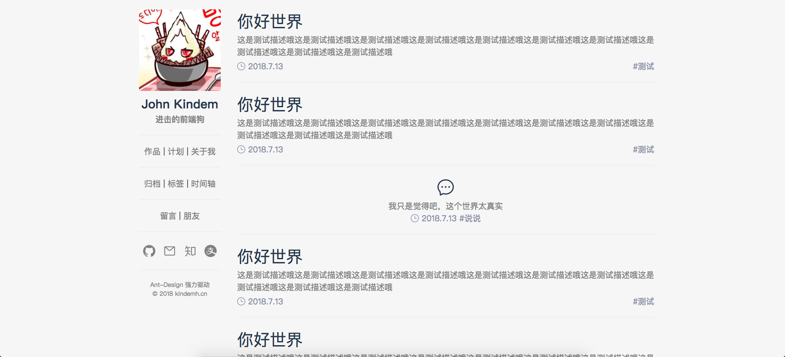

> 发布自[Kindem的博客](http://www.kindemh.cn/)，欢迎大家转载，但是要注意注明出处

一直觉得吧，自己现在的博客和自己的技术水平和审美有一些差距，因为毕竟老博客是原生js撸出来的，而最近一直一直都在练习自己新的前端技术栈，另外，最近自己是在沉迷简约风无法自拔，于是决定用React + Antd重构博客前端。

先放出两张首页预览图：

预计暑假将会上线，实习比较忙，尽力而为
